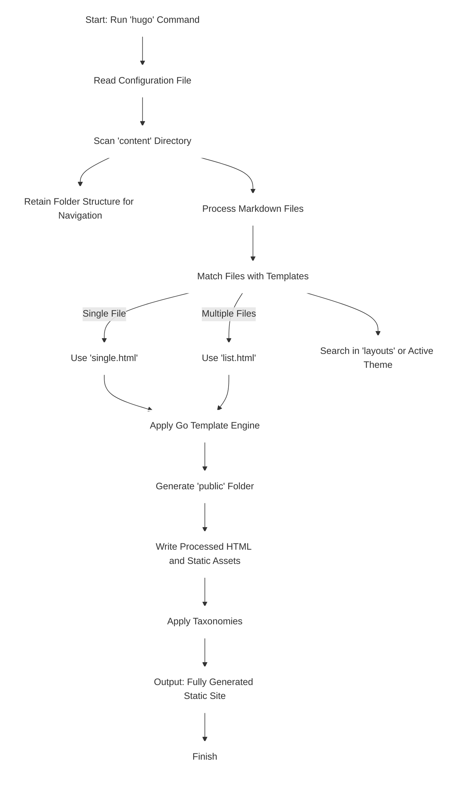

[HUGO](https://gohugo.io) is one of the most popular Open Source tools for static site generation which is being heavily used for blogs (like this one) and docs. It boasts some extreme speeds with nearly all websites getting rendered in "less than a second".  Added to this is a fast-growing community of users and developers and a thriving selection of community themes and many other [features](https://gohugo.io/about/features).

I am mostly focused on attempting to understand the working and reasons why HUGO is where it is right now but have added a section on how to setup a blog similar to this one using HUGO and Github Pages. For those interested in setting up something similar for yourselves, feel free to skip to [setup](#setup)
## How So Fast? {#speed}

The language of choice for achieving this is [Go](https://go.dev). For those who know about Go, you can probably skip to the next section. For those who don't, Go (or Golang) is a statically-typed, compiled language developed by Google centered around the concepts of concurrency and simplicity. As a result of the concurrency offered by Go, HUGO can simultaneously render multiple sites very quickly.

Added to this, HUGO utilizes the Go text/template and html/template packages to produce injection-proof sites. With a custom templating system optimized for, you guessed it, speed, HUGO is able to implement processing and bundling on the fly using their Fast Asset Pipelines.

## Working {#working}

While attempting to look into the inner workings of HUGO, I actually came across this rather interesting [thread](https://discourse.gohugo.io/t/how-does-hugo-work/11037) where a user was attempting to recreate the algorithm. Thanks to that discussion, and the documentation, I was able to recreate a simple flow chart for the working.

## Setup {#setup}