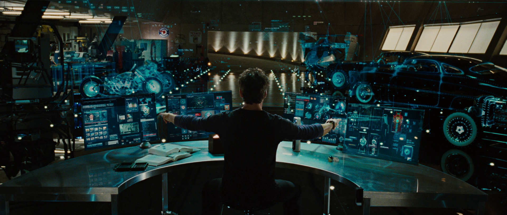
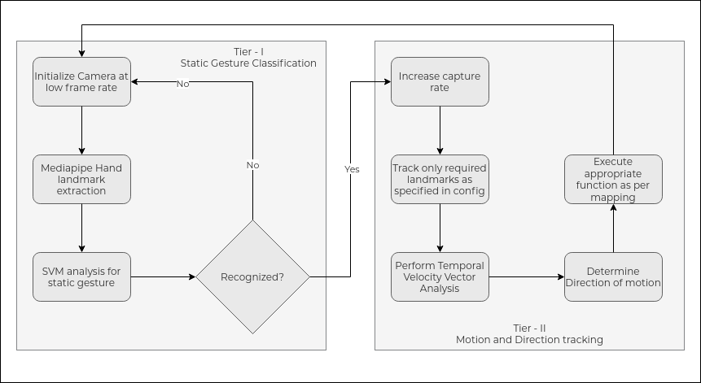
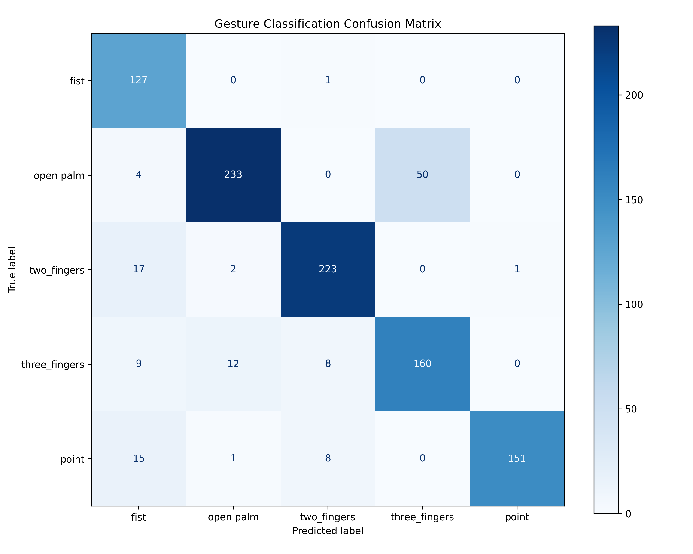

### Contents

- [What I am Making](#what-i-am-making)
- [How it works](#how-it-works)
  - [Tech Stack:](#tech-stack)
  - [Performance & Dataset](#performance--dataset)
    - [Dataset](#dataset)
    - [Classification Report](#classification-report)
- [Concepts and Resources](#concepts-and-resources)
  - [Concepts](#concepts)
  - [Research Papers](#research-papers)
  - [Visualizations and Videos:](#visualizations-and-videos)
- [What are the issues with the current implementation](#what-are-the-issues-with-the-current-implementation)
- [How I am tackling them](#how-i-am-tackling-them)
- [Future Plans](#future-plans)
- [Conclusion](#conclusion)

I think we can all agree that Ironman has some of the coolest tech. From virtual assistants like the infamous JARVIS, F.R.I.D.A.Y., and more, to his awesome suit and of course, the way he interacts with these systems using holographic screens, gestures and voice commands—no keyboard and mouse used at all.



Just having something like this (as shown in the image above) is so cool that I knew that I had to build something like it.

## What I am Making

Enter the AI project from my previous semester, [DyNaGO](https://github.com/KreativeThinker/dynago). DyNaGO stands for "Dynamic and Natural Gesture Operations". That translates to swipes, drag and drop, point, etc., all using real-time gesture analysis using only a webcam. Thus far, it is capable of detecting swipe motions which allows me to scroll, change workspaces, volume control, brightness control, pointer control and more. All these functions can be modified by making changes to a config file and a functions file.

## How it works

I adopted a two-stage model for this. The first stage classifies the static gesture using a Support Vector Machine (SVM) trained on 5 static gestures: point, two fingers (for scrolling), three fingers (volume and brightness), open palm (workspaces and page up/page down), and closed fist (no gesture). These are mapped internally to functions as below in a config file:

```py
# Configuration file snippet
map = {
	"1": {
	    "name": "open palm",
	    "landmarks": [0, 4, 8, 12, 16, 20],
	    "function": [
		    func_left,
		    func_right,
		    func_up,
		    func_down
		] # placeholder functions
	},
}
```

Here, landmarks mentioned in the mapping are the landmarks we are interested in tracking. This reduces the overall SVM complexity making it a much faster and lighter model.

The second stage of the model is a velocity vector analysis which is triggered after the static gesture has been detected. By creating an axis using the shortlisted landmarks, it tracks the displacement of the axis over `k` frames, converts them to a vector, and analyzes the direction of the vector.

This maps to the `function` set in the `map` and executes the custom function.

#### Tech Stack:

- Mediapipe - landmark extraction
- OpenCV - visualization
- Pandas + Numpy - data handling
- SciKit Learn - training the models

I also used Poetry for package and runtime management, and linters and formatters (as always) for ensuring cleaner code.

## Architecture

The project uses a hybrid 2-tier architecture aimed at making the interface accessible even for lighter hardware like raspberry pis, old laptops, etc. The current implementation utilizes an SVM for static gesture classification and a custom velocity vector analysis algorithm which I will explain shortly.


#### Tier I: Static Gesture Classification

The first stage, as mentioned earlier, performs a low frame rate capture analysis to look for a recognized hand gesture. The first step to any image analysis is normalization. Without normalization, the possible combinations of visual inputs would be immense.

```py
def normalize_landmarks(landmarks):
    num_landmarks = 21
    landmarks = np.array(landmarks).reshape(num_landmarks, 3)
    wrist = landmarks[0]
    landmarks -= wrist
    max_dist = np.max(np.linalg.norm(landmarks, axis=1))
    landmarks /= max_dist if max_dist > 0 else 1
    return landmarks.flatten()
```

Here, I am converting the landmarks into vectors of (x, y, z) and normalizing based on the wrist landmark. This allows for a positional and size based normalization reducing the possible input space to a smaller, usable size.

```py
# Using the model I trained
gesture = predict_gesture(norm_landmarks, model)

if gesture == 4 and ENABLE_MOUSE:
	# Here I am handling cursor events.
	# Currently implemented a simple pointer position control.
elif not state["tracking_motion"]:
	# When not tracking motion, check for new gestures every N frames
	# Skipping frames to lower analysis overhead
	if state["frame_count"] % N_FRAMES == 0:
		if gesture == 0:  # No gesture detected
			state["current_gesture_id"] = None
		else:
			# New gesture detected
			# Move control to Tier II
			# Here I append details of the gesture
			# Including raw position values to a dequeue
```

#### Tier II: Temporal Velocity Vector Analysis

This stage uses deques as follows to store values provided by the earlier capture to run parallel to the frame capture and classification process as so

```py
mean_landmark_history = deque(maxlen=10)
landmark_history = deque(maxlen=10)
```

Here, the `mean_landmark_history` is the axis used for tracking the gesture direction. Here is a simplified implementation of the velocity vector analysis:

```py
    start, end = mean_landmark_history[0], mean_landmark_history[-1]
    dx, dy = end[0] - start[0], end[1] - start[1]
    magnitude = math.sqrt(dx**2 + dy**2)

    if magnitude < VEL_THRESHOLD:
        return None

    angle = math.degrees(math.atan2(dy, dx))
    direction = None

    if 150 <= angle <= 180 or -180 <= angle <= -150:
        direction = 0  # Left
    elif -30 <= angle <= 30:
        direction = 1  # Right
    elif 60 < angle < 120:
        direction = 2  # Down
    elif -120 < angle < -60:
        direction = 3  # Up
```

Simpler than the terminology isn't it? (Happens quite often nowadays). For using more complex gestures however, this setup doesn't work. For instance, rotations will also get classified as swipes. This is a limitation of this implementation. Thus, it requires a more real-time check of individual changes. That code however, is very lengthy and slightly more complex as compared to this one which is ideal for understanding the functionality. (In other words, I am stealing the phrase from my math book: "However, this concept is beyond the scope of this chapter" 😅)

#### Why not DNNs to start with?

Mediapipe offers a methodology for training it on the classification of new gestures. However, that requires a very very large dataset which is not present for this current usecase. While the [HaGRID](https://github.com/hukenovs/hagrid) exists for static hand shapes, it doesn't cover the required shapes present in the complete swiping motion. The same dataset has been used for training static (and awkward) hand gesture based HCI which are not the intention for this project. An SVM is significantly accurate, fast and cheaper to train and run on low end systems making it an ideal choice for the project.

### Performance & Dataset

#### Dataset

The full dataset consists of ~1700 labeled gesture instances, with 1022 used in the final evaluation after preprocessing and filtering. The gesture classes are:

```json
{
  "0": "fist",
  "1": "open palm",
  "2": "two fingers",
  "3": "three fingers",
  "4": "point"
}
```

The dataset was split in 80/20 for training and testing.

#### Classification Report (Pinch Removed)

The gesture recognition model was retrained after removing the `pinch` gesture due to high misclassification overlap. Evaluation was done on 1022 test samples across 5 gesture classes.

| Gesture       | Precision | Recall | F1-score | Support |
| ------------- | --------- | ------ | -------- | ------- |
| Fist          | 0.74      | 0.99   | 0.85     | 128     |
| Open Palm     | 0.94      | 0.81   | 0.87     | 287     |
| Two Fingers   | 0.93      | 0.92   | 0.92     | 243     |
| Three Fingers | 0.76      | 0.85   | 0.80     | 189     |
| Point         | 0.99      | 0.86   | 0.92     | 175     |

**Overall Accuracy**: 87%  
**Macro F1 Score**: 0.87  
**Weighted F1 Score**: 0.88

This update significantly improved overall system performance by eliminating a high-confusion class, making the model far more stable in real-world usage scenarios.



More information can be found on the project GitHub. Performance data has been compiled and uploaded. It can be accessed by clicking [here](https://github.com/KreativeThinker/Dynago/blob/main/Experiment_Analysis.md).

## Demo Video (with voice-over)

<video controls>
  <source src="/videos/dynago-demo.mp4" type="video/mp4">
</video>

## Concepts and Resources

This project required me to learn about dataset creation, normalization techniques, computer vision, various ML modeling techniques, and evaluation strategies. Before I started working on this project, I went through some existing literature on the topic as well. Links for the papers are attached below. For learning more about some of the concepts, I referred to other material, which is also linked.

#### Concepts

- SVMs (Support Vector Machines) - [scikit-learn.org](https://scikit-learn.org/stable/modules/svm.html)
- Mediapipe Hands - [ai.google.dev](https://ai.google.dev/edge/mediapipe/solutions/vision/hand_landmarker)
- Dequeues for temporal analysis - [collections.dequeue](https://docs.python.org/3/library/collections.html#collections.deque)
- Model evaluation - [scikit-learn.org](https://scikit-learn.org/stable/modules/model_evaluation.html)

#### Research Papers

- Mahmood Hussien, Nadia & Mohialden, Yasmin & Jbara, Wurood. (2024)
- Jiapeng Luo, Jiaying Liu, Jun Lin, Zhongfeng Wang.
- S. Mitra and T. Acharya, "Gesture Recognition: A Survey"

#### Visualizations and Videos:

- [Support Vector Machine (SVM) in 2 minutes - Visually Explained](https://www.youtube.com/watch?v=_YPScrckx28)
- [The Kernel Trick in Support Vector Machine (SVM) - Visually Explained](https://www.youtube.com/watch?v=Q7vT0--5VII)
- [Learning: Support Vector Machines - MIT OpenCourseWare](https://www.youtube.com/watch?v=_PwhiWxHK8o)

I personally enjoyed the complete [MIT OpenCourseWare playlist](https://ocw.mit.edu/courses/6-034-artificial-intelligence-fall-2010/download/) on AI. For conceptual understanding and foundation building in the field, I would personally recommend it.

## What are the issues with the current implementation

Despite functional success on well-defined gestures, DyNaGO currently suffers from three key technical limitations:

- **Gesture Ambiguity**: The model still struggles with fine gesture separation when gestures are spatially similar or partially occluded.
- **Lack of Temporal Context**: The system relies on frame-wise static classification plus basic velocity vectors. It doesn’t yet handle complex gesture transitions well.
- **No Confidence Filtering or Recovery Logic**: Every gesture prediction triggers an action, even when confidence is low or the user is mid-gesture.

## How I am tackling them

To address these issues, I am implementing:

- **Data Augmentation**: Adding noisy, rotated, and occluded gesture samples to improve generalization in unpredictable real-world conditions.
- **Multi-frame Smoothing & Confidence Thresholds**: Enforcing gesture persistence over `k` frames before activation and filtering low-confidence predictions.
- **Optional Confirmation Layer**: Using a hold-to-confirm model—e.g., requiring an open palm to be detected across two consecutive frames to reduce false positives.
- **Replacing SVM with Lightweight DNN**: Planning to experiment with ONNX-convertible lightweight CNNs, once the dataset is scaled appropriately.

## Future Plans

DyNaGO is still early-stage. Here's what’s coming:

- **Dynamic Gesture Support**: Enable drag, hold, and pinch-to-zoom style continuous interactions.
- **UI Configuration Tool**: Build a GUI to let users bind gestures to scripts or actions without editing config files.
- **Standalone Installer**: Release an installable version via pip or script with bundled models and sane defaults.
- **Voice Control Integration**: Integrate local voice-based commands through an MCP interface, powered by a local LLM.
- **Better Dataset:** I plan to switch to the [HaGRID](https://github.com/hukenovs/hagrid) dataset for better training for the static gesture recognition layer. That will add versatility to the gestures allowing for more elaborate use cases and bindings.

## Conclusion

Building DyNaGO wasn’t just about mimicking Ironman. It was basically me being too lazy to reach forward to scroll PDFs using my laptop’s trackpad when studying (just kidding 😄). It’s about building gesture-powered human-computer interfaces that feel natural—where motion is tied to intent, not an arbitrary click or scroll.

This project helped me dive deep into classical ML, real-time inference, dataset design, and human-centered interface design. It’s far from finished, but it’s a meaningful step toward more intuitive computing.

If this idea interests you, contributions and feedback are always welcome on [GitHub](https://github.com/KreativeThinker/dynago).
